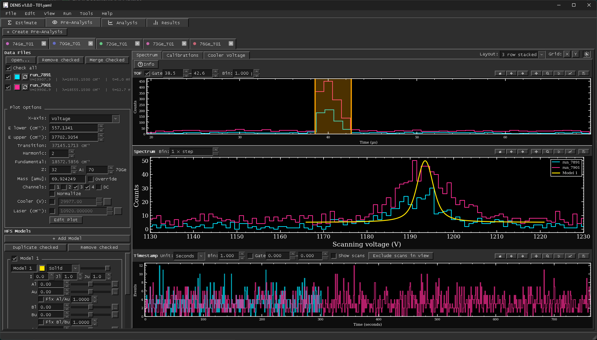
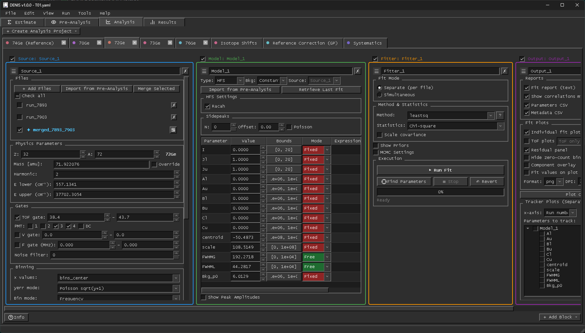
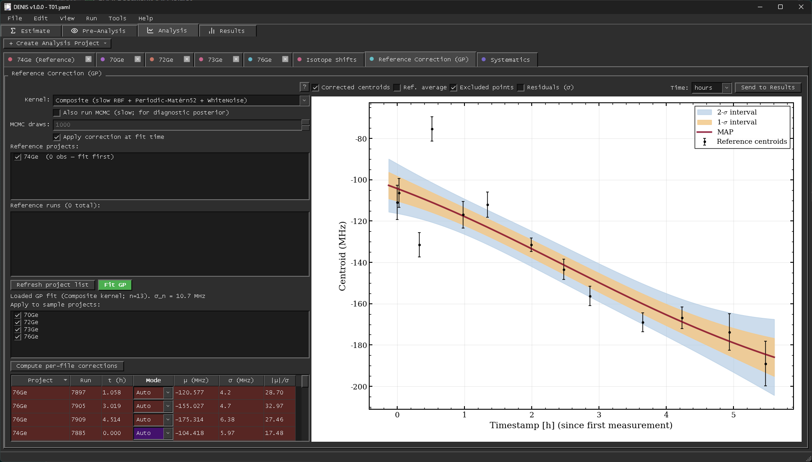

A new version of **[DENIS](https://github.com/ardakayaalp/DENIS)** is out. DENIS (*Doppler Estimation and Numerical Inference for Spectroscopy*) is the desktop toolkit I develop for collinear laser spectroscopy (CLS). It covers the whole chain in one place: beam-time estimation, pre-analysis of the raw runs (@fig:preanalysis), hyperfine fitting with satlas2, isotope shifts and a browser for the results.

{#fig:preanalysis}

## New in 1.1 {#sec:new}

- **Cooler-voltage calibration** from ¹⁷¹Yb⁺/¹⁷³Yb⁺ reference projects, and a **Systematics** tab that scans the calibrated offset and refits the whole analysis chain at every step.
- An **ASDF viewer** for inspecting raw run files.
- **Corner plots** with filled credible regions, with the MCMC burn-in now applied to every output.
- Fixes to likelihood and MCMC statistics and to parameter bounds. The [release notes](https://github.com/ardakayaalp/DENIS/releases/tag/v1.1.0) say which fits to redo.

Sessions saved with 1.0 open unchanged. Fits are built from blocks (@fig:pipeline), and drifts of the reference centroid during a beam time are corrected with a Gaussian process (@fig:gp).

{#fig:pipeline}

{#fig:gp}

## Get it {#sec:get}

DENIS is open source (MIT) and installs with a single command:

```bash
git clone https://github.com/ardakayaalp/DENIS.git
cd DENIS
install.bat full        # Windows; use ./install.sh full on Linux and macOS
```

It is also citable through [Zenodo](https://doi.org/10.5281/zenodo.22081266). Feedback and bug reports are very welcome on [GitHub](https://github.com/ardakayaalp/DENIS/issues).
